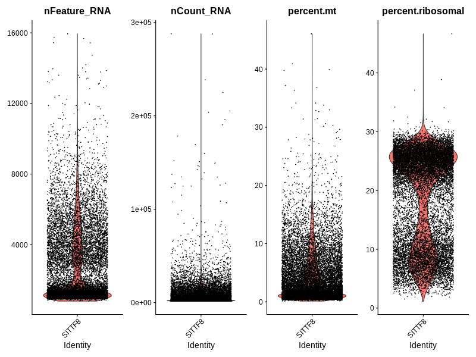
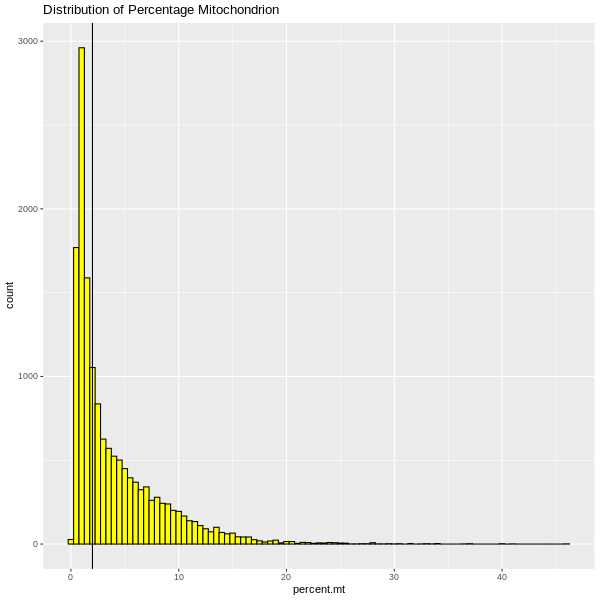
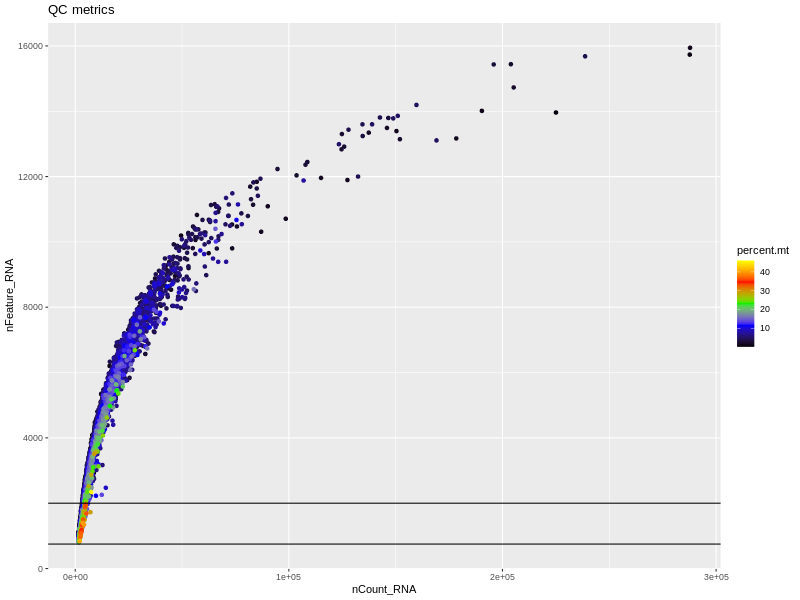
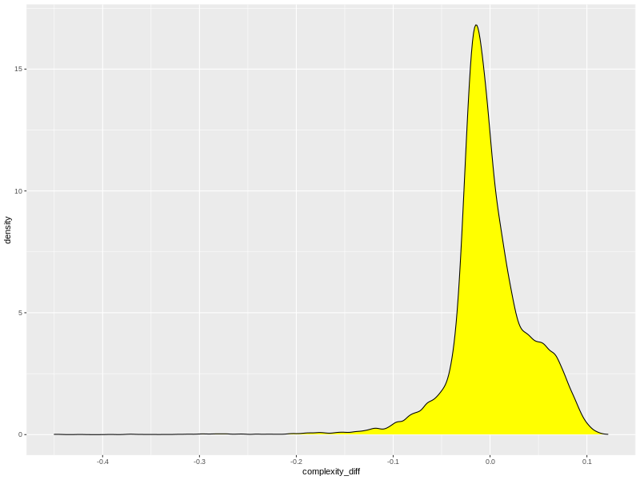
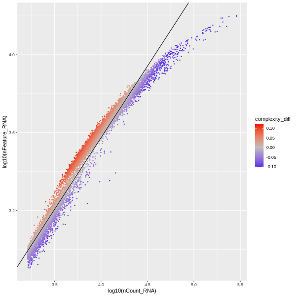
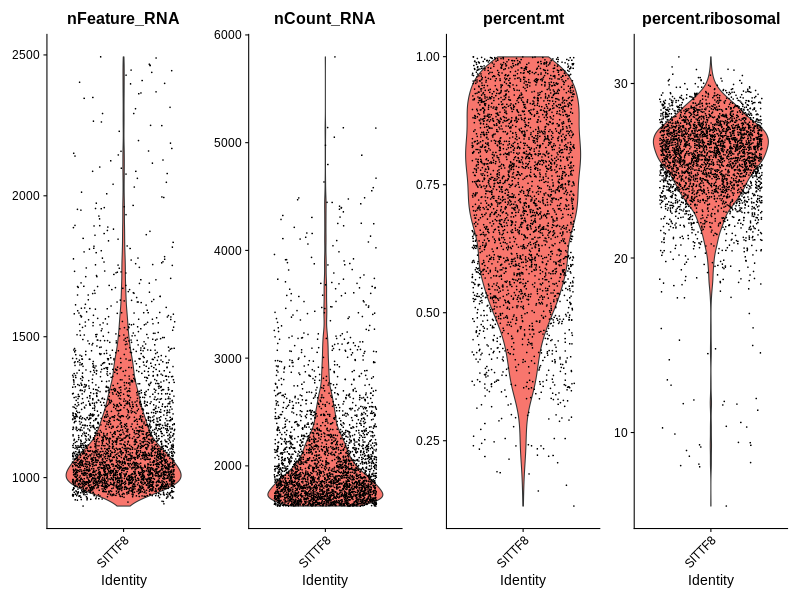
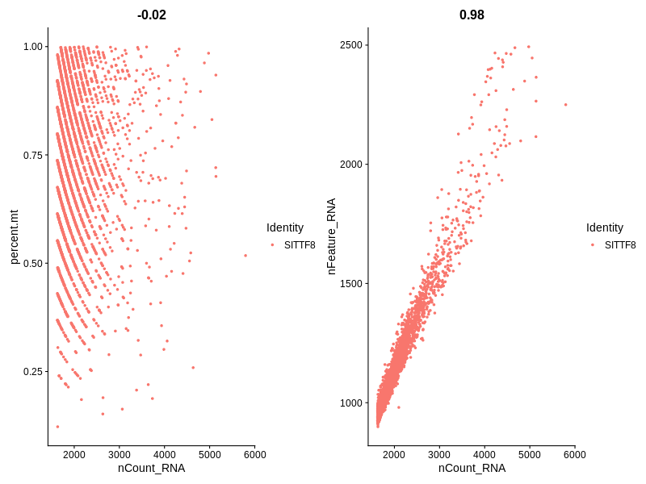

===================================================
**SITTF8 Supporting Plots**
====================================================

SITTF8 
#######

Before Filtering Plots 
-------------------------

.. raw:: html

    

.. image:: SITTF8.features.png
  :width: 400
  :alt: SITTF8  
 
.. raw:: html

    

.. raw:: html

    

.. raw:: html

    

.. raw:: html

    

.. raw:: html

    

After Filtering
-----------------

.. raw:: html

    

 
.. raw:: html

    

.. image:: SITTF8.rmtpc.png  
  :width: 400
  :alt: SITTF8 

.. raw:: html

    

.. image:: SITTF8.rcomplexity.png
  :width: 400
  :alt: SITTF8 

.. raw:: html

    

.. raw:: html

    

.. image:: SITTF8.rQC.png
     :width: 400
  :alt: SITTF8 

.. raw:: html

    

After Normalization 
---------------------

.. image:: SITTF8.feature_selection.png
        :width: 400
  :alt: SITTF8 

.. raw:: html

    

